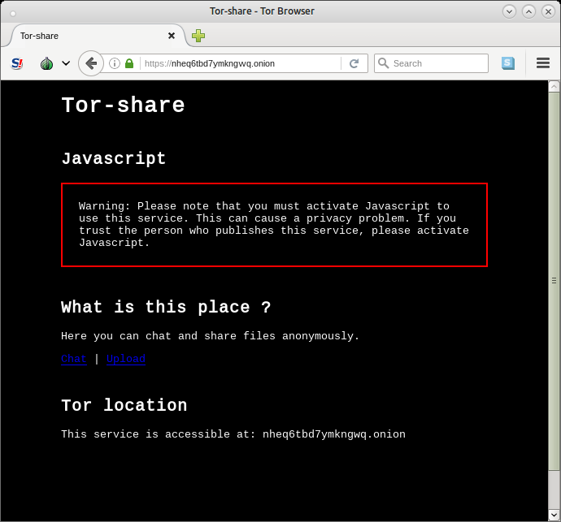

# Tor-share

## Purpose

With Tor-share you can chat, share files or publish a simple PHP website anonymously on Tor network, The Onion 
 Router. Tor-share is a light Alpine Linux Docker image. 

More about Tor network: https://en.wikipedia.org/wiki/Tor_(anonymity_network)

Features:
* Chat 
* Share files
* Publish a simple PHP website

## Launch your hidden service in 2 minutes

Launch Tor-share on Ubuntu 16.04:

    # First you need to install Docker
    $ curl -sSL https://get.docker.com/ | sh
   
    # Then download image and launch container:
    $ docker run -d -p 9050:9050 remipassmoilesel/tor-share
     
    /!\ Warning /!\ 
    - This is a test image, for maximum safety you have to build your own.
      See below, this is just about few minutes.
    - Never, never, never expose other ports to outside. 
      No one should be able to access your container without using Tor. 

## Get URL (location) of hidden service
    
    # First get container IP address 
    $ docker ps 
        
        CONTAINER ID        IMAGE               ...
        2e23d01384ac        ...
  
    $ docker inspect --format '{{ .NetworkSettings.IPAddress }}' 2e23d 
        
        172.17.0.2
    
    # Then visit https://172.17.0.2 address with a normal browser or:
    $ curl -k -u anonymous-tux:password https://172.17.0.2/hostname 
    
        7b436d6e7ipz4kbo.onion

    # Then you can visit https://7b436d6e7ipz4kbo.onion with Tor browser.
    /!\ Visitors have to specify https:// and to add a security exception.
    
 
## Authentication

Visits are restricted with Lighttpd basic authentication. Default credentials are:

    anonymous-tux:password
    anonymous-tux2:password2

Before building you can add users or change passwords:
    
    $ vim etc/lighttpd/lighttpd-password

## Before use Tor-share

- Build your own image ! 

- Change all passwords !
   
## SSH connection for file management

    # When your container is set up, you can connect it in SSH with default credentials (anonymous-tux:password)
    $ ssh -v anonymous-tux@172.17.0.2
    
    # You can change account credentials in Dockerfile:
    $ vim Dockerfile
    
        # Change default credentials here
        RUN  echo "anonymous-tux:password" | chpasswd
        
    # All files are in 'www' directory
    $ cd /www
    $ ls .
    $ ls upload/
    $ ls chat/

        
## Publish a web site

All files in 'www/' directory are accessible via Lighttpd server in Tor browser.

## Build your own image

On Ubuntu 16.04:

    # First you need to install Docker
    $ curl -sSL https://get.docker.com/ | sh

    # After clone this repository and create your image
    $ git clone https://github.com/remipassmoilesel/tor-share
    $ cd tor-share
    $ git submodule init
    $ git submodule update
    $ docker build . -t tor-share
    
    # Then launch a container and expose Tor port
    $ docker run -d -p 9050:9050 tor-share
    
    /!\ Warning /!\ 
    - Never, never, never expose other ports to outside. 
      No one should be able to access your container without using Tor. 
 
